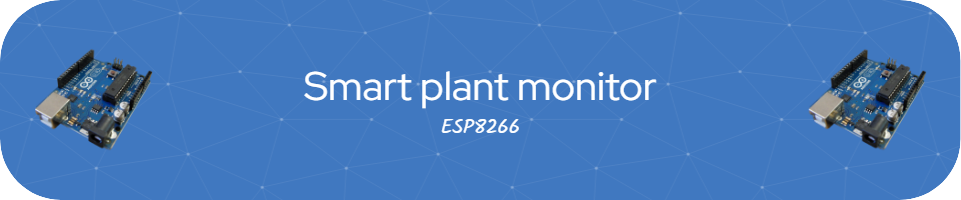

### A smart plant monitoring system using ESP8266, Blynk IoT platform, and soil moisture sensor.


# Table of Contents
1. [Features](#features)
2. [Hardware Requirements](#hardware-requirements)
3. [Pin Connections](#pin-connections)
4. [Software Requirements](#software-requirements)
5. [Secure Credential Storage](#secure-credential-storage)
6. [Time Control System](#time-control-system)
7. [Blynk App Configuration](#blynk-app-configuration)
8. [Installation Steps](#installation-steps)
9. [System Operation](#system-operation)
10. [Debugging](#debugging)
11. [Security Notes](#security-notes)
12. [Maintenance](#maintenance)

# Features
- Real-time soil moisture monitoring with averaging for accurate readings
- Dual LED system:
  - Manual control LED via Blynk app
  - Automatic alert LED for water level warnings
- Configurable watering threshold through Blynk app
- Sophisticated time-based LED control:
  - Customizable ON/OFF hours
  - Handles both standard and overnight schedules
  - Automatic synchronization with Blynk server time
  - Minute-by-minute schedule checking
- Secure credential storage using encrypted EEPROM
- Real-time clock integration for time-based operations
- Automatic reconnection handling
- Detailed serial debugging output
- Basic encryption for stored credentials

# Hardware Requirements
- ESP8266 board (NodeMCU, Wemos D1 Mini, etc.)
- Soil moisture sensor
- 2x LEDs:
  - Manual control LED
  - Alert indicator LED
- 2x 220Ω resistors for LEDs
- Jumper wires
- USB cable for programming

# Pin Connections
- Manual Control LED → D2 (with 220Ω resistor)
- Alert LED → D1 (with 220Ω resistor)
- Soil Moisture Sensor → A0
- VCC → 3.3V
- GND → GND

# Software Requirements
- Arduino IDE
- Required Libraries:
  - ESP8266WiFi
  - BlynkSimpleEsp8266
  - TimeLib
  - EEPROM

# Secure Credential Storage
## Encryption System
- Basic XOR encryption for all credentials
- Unique encryption key (customizable)
- Encrypted storage in EEPROM
- Secure storage of:
  - Blynk authentication token (32 bytes)
  - WiFi SSID (32 bytes)
  - WiFi password (64 bytes)

## Storage Layout
- Total EEPROM allocation: 512 bytes
- Organized storage:
  - Bytes 0-32: Encrypted Blynk token
  - Bytes 33-64: Encrypted WiFi SSID
  - Bytes 65-128: Encrypted WiFi password

## Security Features
- Null-termination encryption
- Padding for fixed-length storage
- Verification system for stored credentials
- Separate EEPROM writer program for initial setup

# Time Control System
## Schedule Types
1. Standard Schedule (When ON hour < OFF hour)
  - Example: ON at 8:00, OFF at 17:00
  - LED operates during daytime hours

2. Overnight Schedule (When ON hour > OFF hour)
  - Example: ON at 20:00, OFF at 6:00
  - LED operates through night hours

## Time Synchronization
- Daily synchronization with Blynk server
- Minute-resolution checking for accurate timing
- Automatic state updates to Blynk app
- Failsafe reconnection if server connection is lost

# Blynk App Configuration
- Virtual Pin V0: Manual LED control button
- Virtual Pin V1: Water threshold slider (0-100%)
- Virtual Pin V2: Alert status indicator
- Virtual Pin V3: LED ON time setting
- Virtual Pin V4: LED OFF time setting
- Analog Pin A0: Water level display

# Installation Steps

## 1. Install Required Libraries
In Arduino IDE:
- Go to Tools → Manage Libraries
- Search and install:
  - Blynk
  - ESP8266WiFi (comes with ESP8266 board manager)

## 2. Blynk Setup
1. Create a new Blynk project
2. Note down your:
  - BLYNK_TEMPLATE_ID
  - BLYNK_TEMPLATE_NAME
  - BLYNK_AUTH_TOKEN

## 3. Configure Credentials
1. Open `EEPROM.ino`
2. Update the following constants with your values:
```cpp
const char BLYNK_AUTH[] = "YOUR_BLYNK_TOKEN";
const char WIFI_SSID[] = "YOUR_WIFI_SSID";
const char WIFI_PASS[] = "YOUR_WIFI_PASSWORD";
```
3. Set custom encryption key:
```cpp
const byte encryptionKey = 0xA7;  // Change this value
```
4. Upload EEPROM writer program first
5. Verify successful credential storage
6. Upload main program

## 4. Sensor Calibration
The system uses the following default calibration values:
```cpp
#define SENSOR_DRY 10    // Value when completely dry
#define SENSOR_WET 890   // Value when in water
```
Adjust these values based on your sensor's readings.

# System Operation
- The system takes averaged sensor readings for improved accuracy
- Water level is displayed as a percentage (0-100%)
- Alert LED activates when water level goes below set threshold
- Manual LED can be controlled independently through the Blynk app
- Time-based LED control operates based on user-defined schedule
- LED state changes occur within each hour
- Supports cross-minute operation when ON second is greater than OFF second

# Debugging
- Serial output provides detailed information at 115200 baud rate
- Monitors:
  - Raw sensor readings
  - Calculated water levels
  - Current threshold values
  - LED states
  - Connection status

# Security Notes
- Change default encryption key before deployment
- Verify credentials after writing
- Keep encryption key secure
- EEPROM has limited write cycles (~100,000)

# Maintenance
- Regularly check soil moisture sensor calibration
- Clean sensor probes as needed
- Monitor serial output for system status
- Keep Blynk app and libraries updated