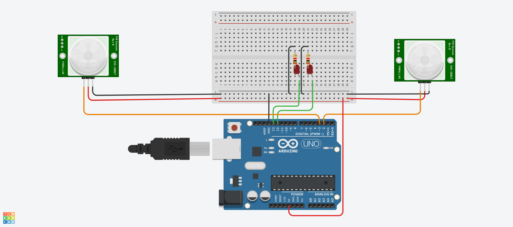

# PIR-Based Staircase Lighting System

This project is a simple motion detection system using two PIR (Passive Infrared)
sensors and LEDs. When motion is detected by either sensor, the corresponding LED lights up, and a message is printed to the serial monitor.
This project will evolve into a staircase lighting solution. 🚶‍♂️💡

📄 [Back to main README](../README.MD)

## Table of Contents
- [Features](#features)
- [Hardware Requirements](#hardware-requirements)
- [Pin Connections](#pin-connections)
- [Software Requirements](#software-requirements)
- [Installation Steps](#installation-steps)
- [System Operation](#system-operation)
- [Debugging](#debugging)
- [Security Notes](#security-notes)
- [Maintenance](#maintenance)

## **Features**

✅ **Motion detection via PIR sensors to activate LED lighting.**  
✅ **Directional lighting based on movement direction.**  
✅ **Auto turn-off after a predefined delay to save power.**  
✅ **Configurable LED sequences for smooth illumination.**  
✅ **Serial debugging for monitoring sensor states.**  

## Hardware Requirements
- Arduino board (Uno, Mega, or equivalent)
- 2x PIR sensors (for detecting movement direction)
- 2x LED strips or individual LEDs (or as many as you would like)
- 2x 220Ω resistors (for LEDs if necessary, same amount as LEDs)
- Jumper wires
- Breadboard
- USB cable (for programming)

## Pin Connections

| Component         | Arduino Pin |
|-------------------|-------------|
| PIR Sensor (Up)   | D2          |
| PIR Sensor (Down) | D3          |
| LED 1             | D12         |
| LED 2             | D13         |
| VCC (PIR, LED)    | 5V          |
| GND (PIR, LED)    | GND         |

## Software Requirements
- Arduino IDE

## Installation Steps
1. Connect the components according to the wiring diagram.
2. Install and open the Arduino IDE.
3. Download the file staircaselighting.ino, and open it in Arduino IDE.
4. Select the correct board and COM port.
5. Upload the code to the Arduino.
6. Open the Serial Monitor (9600 baud) to observe debugging messages.

## System Operation
⚙️ How It Works:
- The system continuously monitors the PIR sensors.
- When a person moves up, LEDs light up in an upward sequence.
- When a person moves down, LEDs light up in a downward sequence.
- LEDs turn off automatically after 10 seconds.
- Serial output displays sensor status and process updates.

## Debugging
🔍 Serial Debugging (9600 baud rate)
- Monitors:
    - PIR sensor states before activation
    - Triggered light sequences
    - Completion of light loop

## Future Improvements
- Add a buzzer for audible alerts.
- Implement a time delay to prevent false triggers.
- Use wireless communication (e.g., ESP8266) to send motion alerts to a mobile app.

## Security Notes
🔐 Best Practices:
✔ Ensure proper wiring to avoid short circuits.  
✔ Use resistors with LEDs to prevent overcurrent.  
✔ Secure PIR sensors to avoid misalignment.  
✔ Adjust sensor sensitivity if needed to reduce false triggers.  

## Maintenance
🛠 Routine Checks:
- Verify PIR sensor alignment.
- Inspect LED connections for wear or looseness.
- Monitor serial output for potential errors.
- Adjust delays if necessary for better user experience.

🚀 **Enjoy your motion activated staircase lighting system!**
